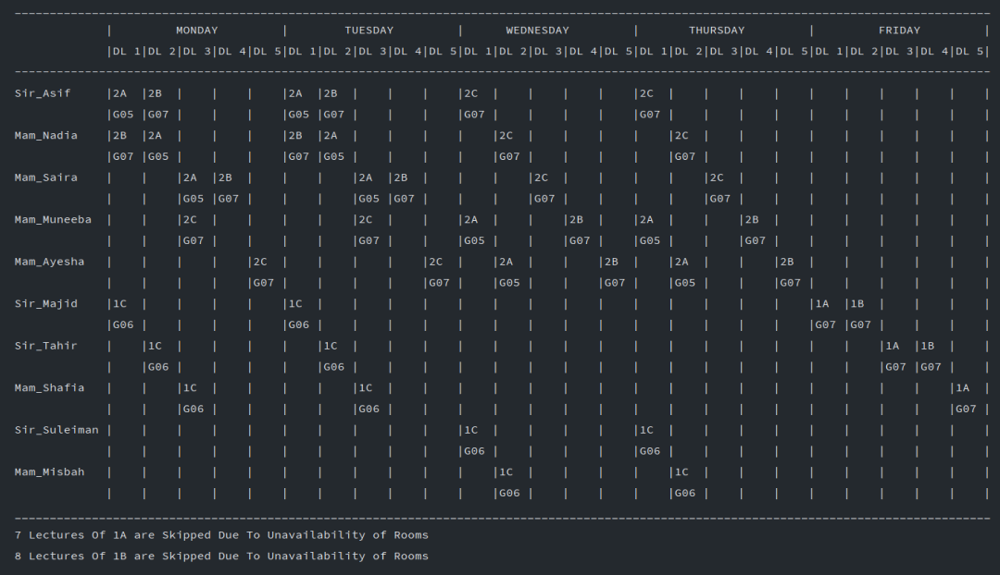

# timetable-generator

This java program generates time table based on certain rules.

### rules :dart:

- A Teacher has a maximum of 2 lectures in a day.
- A Teacher can take a maximum of 1 lecture in a particular class in a day.
- A Teacher can take a maximum of 2 lectures in a particular class in a week.
- A Class has a maximum of 3 lectures in a day.

## note :warning:

Teachers, their Courses, and Classes are hardcoded. They all are stored in their specific Arrays. But you can change the data to use that program for your needs.

## flow

When the program starts to execute, it asks how many Rooms are available and their capacity. And asks the capacity of the Classes.

### what it does

It checks that whether at a particular time slot:

- A particular Teacher is free
- A particular Class is free
- Any room is available
- If a room is available, would it have the capacity to fit the class in?

Considering all these checks and the above rule program generates a timetable 🚩. At the end, the program also displays the Classes that are unable to take all their lectures.

## instructions

Follow the below step to run the code:

```
git clone https://github.com/MSarmadQadeer/timetable-generator.git
cd timetable-generator
javac Main.java
java Main.java
```

## screenshots



